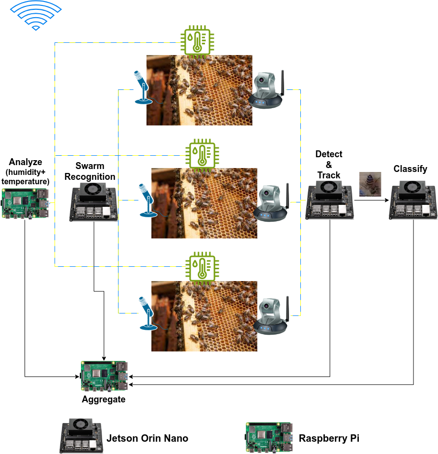

# Wireless Multimedia Sensor Networks in Beehive AI monitoring

The overal procedure is as follows:

All beehives include sensors for measuring humidity, temperature, and weight, as well as cameras and microphones. Since there are many hives, and they are likely far from servers or the beekeeper’s location, mid-processing should be done at the edge using edge devices and wireless multimedia sensor networks.

All sensor data can be processed using a low-resource, inexpensive device like a Raspberry Pi, as it only requires simple calculations and comparisons. Camera data is passed to a low-resource bee detection service (which may run on a Jetson). The bee images can then be processed by a classification model to detect any inconsistencies (which may be run on another Jetson). Audio samples can be analyzed by a sound processing service (possibly running on a Jetson) to detect any issues in swarm sounds.

# Sensors Analysis
Our analysis of the sensors is available in the file `BeeHive_sensors_analysis.ipynb`. Although the analysis is based on structured data, the dataset contains missing values and is not entirely reliable. Additionally, we lack crucial contextual information, such as when the data reflected normal conditions or disasters. For instance, we do not know why the temperature dropped too low or spiked, or whether the low weight readings indicated bees dying, sensor errors, or some other issue. Therefore, while the analysis has been explained, it is important to note that the data is not sufficiently accurate.

# Image Processing
Our image processing is available in the file `Bee_Image_processing.ipynb`. Our image processing pipeline consists of two distinct modules: bee detection and bee problem classification. This allows both modules to run efficiently in parallel.

First, the object detection model extracts images of all bees in the input image. Then, the classification model categorizes the bee images as either healthy or unhealthy, specifying the type of problem for the unhealthy bees. This setup enables batch processing, improving efficiency and performance.

The 'missing queen' unhealthy class has only a few samples, all from a single location. Although this condition is important, it cannot be detected properly due to the lack of data. Consequently, we generate additional samples for 'missing queen' using data augmentation.

Additionally, the 'few Varroa, hive beetles' and 'Varroa, small hive beetles' categories in the health column both detect 'Varroa mites and hive beetles'. Therefore, they will be combined.

# Related Directories
- Detecting the Health Status of Honeybees with Neural Networks on [kaggle image dataset] (https://www.kaggle.com/jenny18/honey-bee-annotated-images) : <https://github.com/rogall-e/Health-of-Beehives/tree/master>

